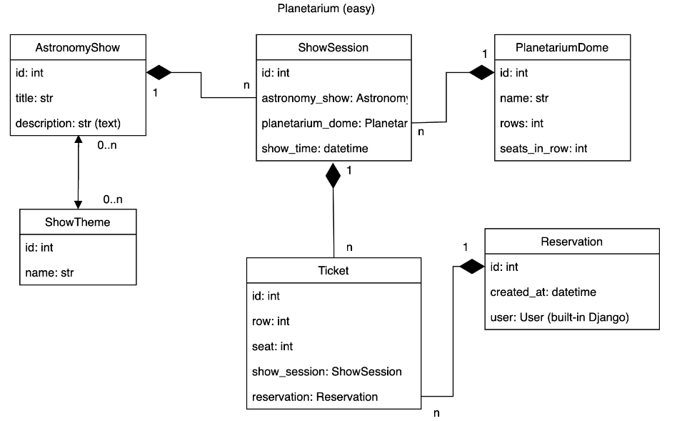
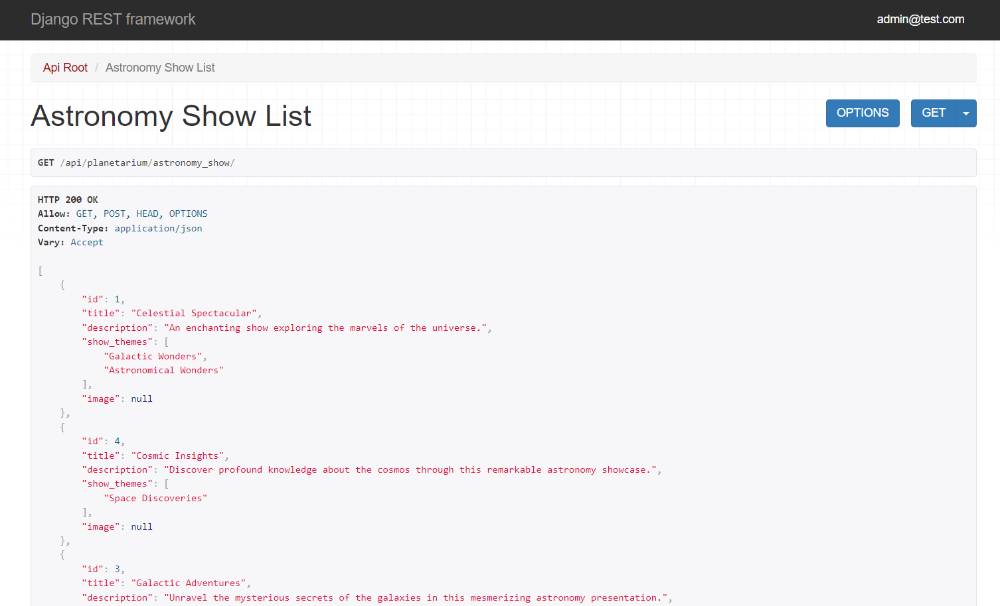

# Planetarium Api Service

API service that provides the possibility to book tickets online for favourite ShowSessions in Planetarium

## Features

* JWT authenticated
* Admin panel/admin/
* Managing reservations and tickets
* Creating astronomy shows
* Creating astronomy domes
* Adding show sessions
* Filtering astronomy shows and show sessions

### Documentation
For detailed information and API documentation, visit:
http://127.0.0.1:8000/api/doc/swagger/


# Db structure



## Installing using GitHub

Python3 must be already installed.

For Windows:
```shell
git https://github.com/OstapIvakh/planetarium-api-service.git
cd planetarium-api-service
python -m venv venv
source venv/Scripts/activate
pip install -r requirements.txt
python manage.py migrate
python manage.py loaddata planetarium_db_data.json
python manage.py runserver
```
For Mac (and Linux):
```shell
git https://github.com/OstapIvakh/planetarium-api-service.git
cd planetarium-api-service
python -m venv venv
source venv/bin/activate
pip install -r requirements.txt
python manage.py migrate
python manage.py loaddata planetarium_db_data.json
python manage.py runserver
```


### Authorization via JWT
* create user via api/user/register
* get access token via api/user/token

# Demo


